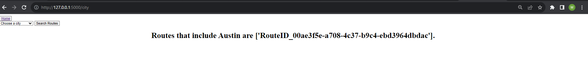

# Amazon Routing Dashboard

##Introduction
### Welcome to the Amazon Routing Dashboard project. This project leverages the rich dataset obtained from Amazon's 2021 Last Mile Routing Research. The dataset has been meticulously processed to extract valuable information from 10 specific routes stored in an S3 bucket. The goal is to make this data accessible for various purposes.

##Data Transformation
### The first step involved transforming the data to make it compatible with the Google Matrix API. This transformation enabled the calculation of route distances and times while also allowing for the visualization of route locations on an interactive map using the Folium library.

##Data Storage
###The transformed data was loaded into a SQLite database for efficient management and querying. This database's architecture supports filtering routes by city, making it easy to extract route-specific information.

##Functionality
#### Here is the home page

#### Here is how I extracted the data from the S3 Bucket

#### Here is how I loaded the data into a sqlite db using sqlalchemy

#### Here is what the db looks like

#### Here is an example of the filter by city function being used

#### Here are the finished results of selecting a route. This project represents a comprehensive exploration of Amazon's routing data, offering a user-friendly dashboard for efficient data analysis and visualization.

