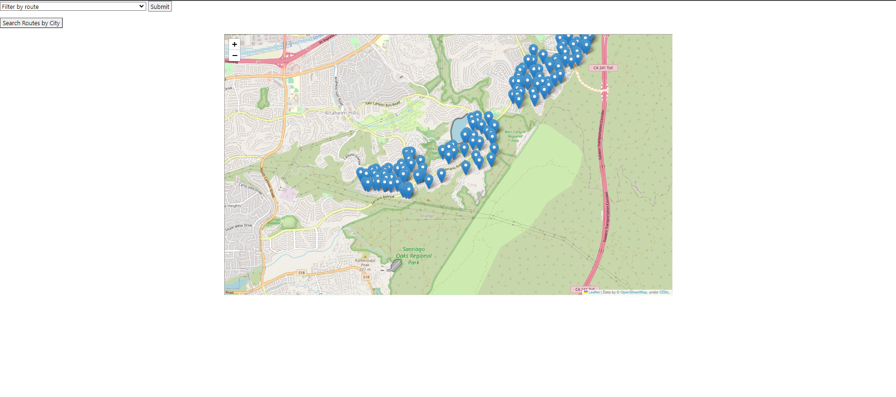
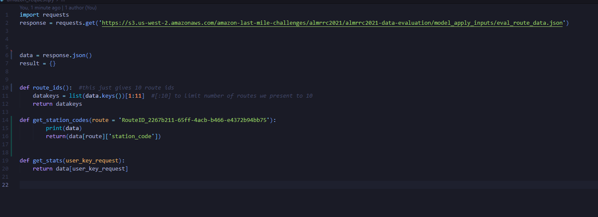
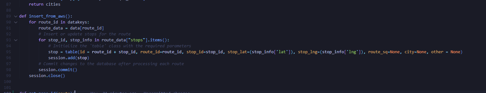
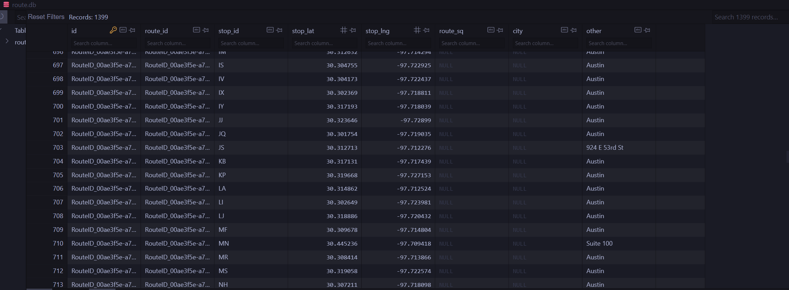
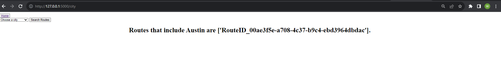
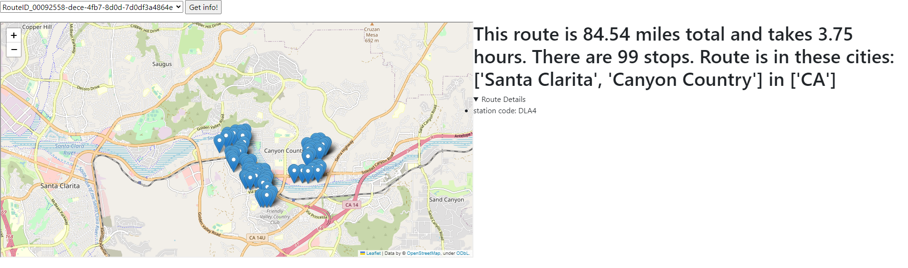
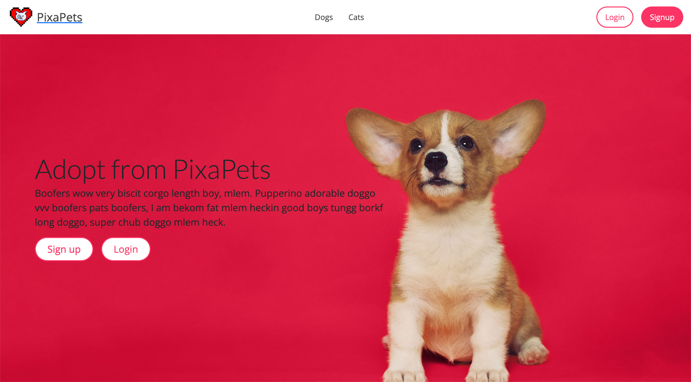
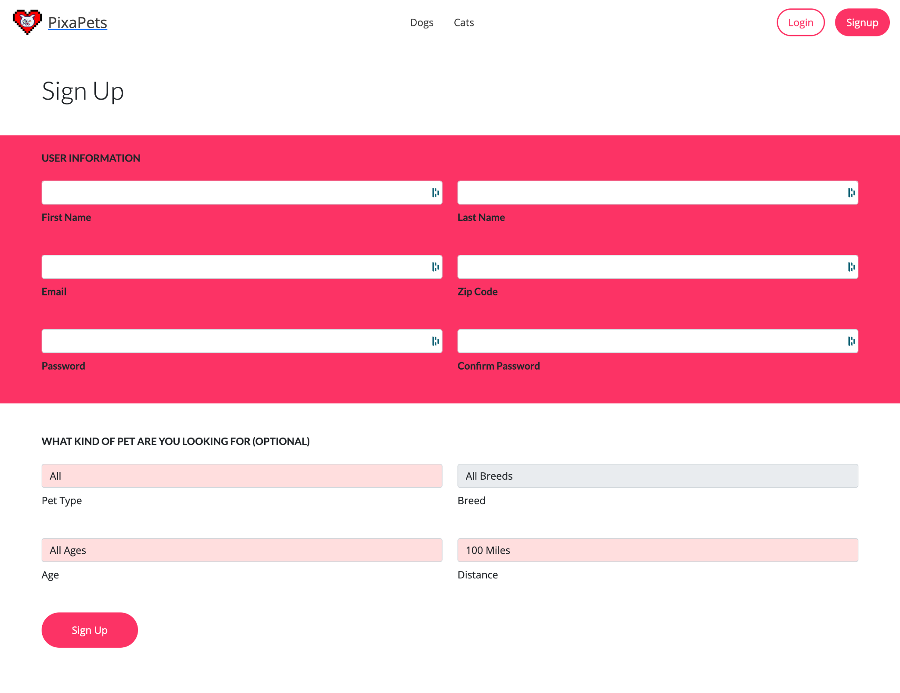
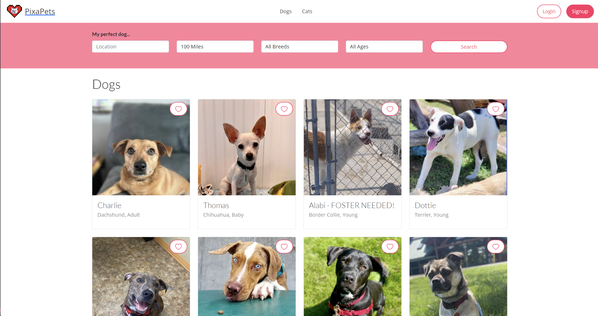
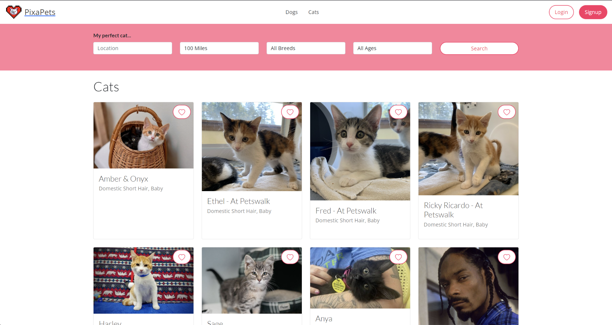

# Project Portfolio

Welcome to my website.  You can find me on [LinkedIn](https://www.linkedin.com/in/william-chen-5456261a9/) or email me at williamchen5667@gmail.com

# [Amazon Routing Dashboard](https://github.com/wchenn/driver)

## Introduction

Welcome to the Amazon Routing Dashboard project. This project leverages the rich dataset obtained from Amazon's 2021 Last Mile Routing Research. The dataset has been meticulously processed to extract valuable information from 10 specific routes stored in an S3 bucket. The goal is to make this data accessible for various purposes.

## Data Transformation

The first step involved transforming the data to make it compatible with the Google Matrix API. This transformation enabled the calculation of route distances and times while also allowing for the visualization of route locations on an interactive map using the Folium library.

## Data Storage

The transformed data was loaded into a SQLite database for efficient management and querying. This database's architecture supports filtering routes by city, making it easy to extract route-specific information.

## Functionality

### Home Page

### Data Extraction from S3 Bucket

### Data Loading Using SQLAlchemy

### SQLite Database Overview

### Filtering Routes by City

### Route Selection and Results

Here are the finished results of selecting a route. This project represents a comprehensive exploration of Amazon's routing data, offering a user-friendly dashboard for efficient data analysis and visualization.

# [PixaPets](https://github.com/melmai/pixapets)

## Introduction

PixaPets is a collaborative project completed as part of TCSS 506 (Practical Full Stack Development). It was developed in partnership with my classmates, Melissa Wong and Madison Stehle. This application harnesses the Petfinder API to access its extensive database, providing users with a convenient platform for discovering and adopting pets.

## Features

- **Pet Discovery**: PixaPets displays available pets for adoption in the user's vicinity, offering a diverse selection of potential furry companions.

- **Customized Filtering**: Users can effortlessly refine their search for the perfect pet through a variety of filters, making it easier to find the ideal match.

- **User Accounts**: The app allows users to create accounts, enabling them to save pets they are interested in for future reference.

## Technologies Used

This application is built with the following technologies:

- **Python**: The primary programming language used to power the application.
- **Flask**: Utilized for web development, routing, and data management.
- **Bootstrap**: Ensuring a responsive and visually appealing user interface.
- **WTForms**: Enabling user input and form handling.
- **Postman**: Used for API testing and validation.
- **SQLite Database**: Employed for efficient data storage and management.
- **Amazon EC2 Server**: The application was deployed on an Amazon Elastic Compute Cloud (EC2) server for accessibility and reliability.

## Screenshots

Explore PixaPets through these screenshots:

### Home Page

### Registration

### Dogs

### Cats

# [Trivia Quiz](https://github.com/melmai/pixapets](https://github.com/melmai/504-trivia-quiz)https://github.com/melmai/504-trivia-quiz)

## Introduction
This project was completed as part of TCSS 504 (Software Engineering and Development Techniques) in collaboration with Melissa Wong and Madison Stehle. The project revolves around a maze featuring doors that can be unlocked by correctly answering random trivia questions. Once a user answers a question incorrectly, the corresponding door becomes permanently locked. The maze itself is randomly generated, and the trivia questions are stored in an SQLite database.

Some of the features of this game include saving and loading, by pickling, and a God mode which allows users to traverse all doors freely.

The objective of the game is to reach the exit, and victory is achieved by successfully navigating the maze. However, if the user makes incorrect answers that lead to permanently locked doors, the game is lost if reaching the exit is no longer possible due to these locked doors. The entire game is played through the terminal, offering a unique and challenging gaming experience.

### Winning Condition
<iframe width="560" height="315" src="https://www.youtube.com/embed/1WHbVA92ABQ?si=eftYnl9UieJqOT4w" title="YouTube video player" frameborder="0" allow="accelerometer; autoplay; clipboard-write; encrypted-media; gyroscope; picture-in-picture; web-share" allowfullscreen></iframe>
### Losing Condition
<iframe width="560" height="315" src="https://www.youtube.com/embed/_1W1T_NjmCY?si=se6U7LlaOCt4Lo0q" title="YouTube video player" frameborder="0" allow="accelerometer; autoplay; clipboard-write; encrypted-media; gyroscope; picture-in-picture; web-share" allowfullscreen></iframe>
### Saving/Loading
<iframe width="560" height="315" src="https://www.youtube.com/embed/xcpsBa-vuiQ?si=-Znz0zKsgBeS3cSy" title="YouTube video player" frameborder="0" allow="accelerometer; autoplay; clipboard-write; encrypted-media; gyroscope; picture-in-picture; web-share" allowfullscreen></iframe>
